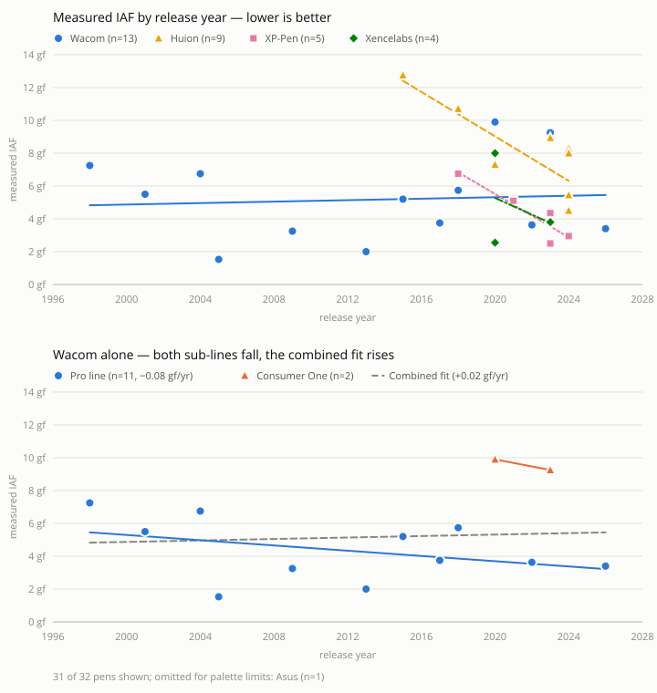

# WebMCP — user scenarios

**Audience:** contributors · What a user would actually _do_ with agent-facing
tools on this site, and why those things beat the UI alone.

Scenarios first. The tool surface is derived from these, not designed ahead of
them — see § Tools implied, which is deliberately a consequence rather than a
proposal.

## The premise

Chatting with a data explorer is not, by itself, interesting. This site is
already fast at browsing, filtering and sorting — an agent that just narrates the
tablets list is strictly worse than the tablets list.

Agent access wins in exactly three places:

| Where it wins          | Because                                                                                  |
| ---------------------- | ---------------------------------------------------------------------------------------- |
| **Outside context**    | The agent knows things the app never will — a listing in another tab, a budget, a review |
| **Absent joins**       | The dataset supports questions no page answers, and a page for each is not viable        |
| **Tedious multi-step** | Flag six things → compare → export → write it up is 20 clicks and one sentence of intent |

Everything below is an instance of one of those three. If a scenario isn't, it
probably shouldn't be a tool.

## A. Someone who owns or is buying a tablet

### A1 — "I have a CTL-4100, what pens fit it and what should I pay?"

The app has the compatibility half (`PenCompat`); it has no idea what anything
costs. The agent supplies price context, the app supplies ground truth about what
physically works.

- **Wins on:** outside context
- **Beats the UI because:** the compatible-pens list is on the tablet detail
  page, but "and which of these is a sensible buy" is not a question the page can
  hold.

### A2 — "I'm looking at this listing — is the pen it comes with any good?"

The user has a marketplace tab open. The agent reads the listing, extracts the
pen model, and asks this site for the measured pressure behaviour.

- **Wins on:** outside context
- **Beats the UI because:** this is a two-source question. **No amount of UI work
  makes it answerable in-app** — the other half lives in another tab. This is the
  clearest argument for agent access on this site.

### A3 — "The spec says 10 gf initial activation force. Is that good?"

Turns a bare number into a judgement using the same LIMITED / OK / GOOD /
EXCELLENT / EXCESSIVE bands the Reference page uses, plus where the pen actually
lands against measured peers.

- **Wins on:** absent joins (spec sheet vs. measured distribution)
- **Beats the UI because:** the bands are on `/reference` and the measurements
  are on `/pressure-response`; nothing puts a specific pen against both.

### A4 — "What's the difference between the Kamvas 22 and the Kamvas 22 Plus?"

The single most frequently asked question. The asker wants a short table of what
actually differs — not a spec sheet, not a page.

- **Wins on:** tedious multi-step
- **Beats the UI because:** `/tablet-compare` renders **all** fields and
  highlights the differing cells (`differs` class in
  `src/routes/tablet-compare/+page.svelte`). There is no differences-only view,
  and getting there costs: find tablet 1, flag, find tablet 2, flag, switch to
  the Compare tab. The asker wants five rows they can paste into a reply.
- Walked through below. It is the scenario that produced requirements 6 and 7.

## B. Pressure-data analysis (the maintainer)

### B1 — "Which of my pens disagree with themselves across units?"

`resolveRangeByUnit` already applies measured-wins-per-unit for **one** pen. The
interesting question is the cross-pen one: where does unit-to-unit variance
exceed what the model expects?

- **Wins on:** absent joins
- **Beats the UI because:** the IAF / MAX tabs are per-pen by construction. A
  "variance across everything I own" view has no page and probably doesn't
  deserve one.

### B2 — "Write up my three best pens for a forum post."

Flag three pens → combined IAF comparison → export the chart → assemble prose
with the SVG embedded.

- **Wins on:** tedious multi-step
- **Beats the UI because:** every piece exists (`FlagButton`, `/pen-compare`,
  `ChartExportButton`) and stitching them is pure clicking. The export flatten
  already produces a self-contained SVG, so the artifact is genuinely portable.

### B3 — "Something looks wrong with the KP-503E numbers."

Run the data-quality checks, explain which rule fired in plain language, and
propose the concrete `data-repo` edit.

- **Wins on:** tedious multi-step
- **Beats the UI because:** `/data-quality` reports _that_ a rule fired. The
  explanation and the fix are the parts a human currently supplies.

## C. Curation (the maintainer, doing chores)

### C1 — Bulk link-review triage

`/links-review` holds ~290 extracted links across 61 entities awaiting a verdict.
An agent proposes verdicts with reasons; the human approves or overrides in the
existing UI, then exports.

- **Wins on:** tedious multi-step
- **Note:** the human stays in the loop by design. The tool proposes; it does not
  decide.

### C2 — OTD name matching beyond Wacom

The OpenTabletDriver join is clean for Wacom and ragged elsewhere. Fuzzy
model-name matching is what an agent is good at and what a deterministic script
is bad at.

- **Wins on:** absent joins

## D. Writers and researchers

### D1 — "Chart of tablet releases by brand, 2010–2025, for my article."

Query, shape, export. The output is a file, not a page view.

- **Wins on:** tedious multi-step

### D2 — "Do advertised pressure specs match measured reality, by brand?"

Both halves are in the dataset. Nothing joins them.

- **Wins on:** absent joins

### D3 — "Has pen pressure performance actually improved over time?"

Measured IAF against release year, by brand. Walked through below.

- **Wins on:** absent joins
- **Beats the UI because:** nothing crosses `ReleaseYear` with resolved pressure
  ranges, and the answer is a trend, not a row.

## E. Handing state back to a human

### E1 — "Set me up a view of discontinued Wacom tablets with tilt, by release date."

The agent composes the view; the user gets a working page and a shareable link.

- **Wins on:** tedious multi-step
- **Dependency worth noticing:** the user manual records that saved views live
  only in localStorage and there is **no URL-encoded view state yet**. A "hand the
  human a link" tool needs that encoding — which is already on the wanted list
  independently. E1 gives it a second reason to exist, and the encoding helps
  humans whether or not an agent ever calls it.

## Walkthrough — D2, run for real

Scenario D2 ("do advertised pressure specs match measured reality?") was executed
against the live dataset rather than reasoned about. It is the reference case
because it **half-failed**, and the failure produced two requirements that
armchair design missed.

### What happened

| Step                      | Result                                                         |
| ------------------------- | -------------------------------------------------------------- |
| Pens in dataset           | 141                                                            |
| …with an advertised `IAF` | **5 (4%)**                                                     |
| …also having measured IAF | **4** — all HUION                                              |
| Finding                   | HUION advertises 2 gf; measured medians are 4.45–8 gf (2.2–4×) |

The finding is real and worth chasing. It is also **n=4 and single-brand**, so
"manufacturers overstate IAF" is not a supported claim — "HUION's four
measurable pens miss their spec by 2–4×" is.

### Requirement 1 — analysis tools must return denominators

An agent handed only the results table would have reported a confident,
well-formatted, badly-founded answer. The 4% coverage _is_ the headline, and it
has to arrive in the same payload as the rows.

> Every analysis tool returns `{ rows, coverage }`. Never rows alone.

### Requirement 2 — `describe_fields` must report fill rates, not just types

The right agent behaviour is to notice 4% coverage **before** committing to the
analysis, say so, and pivot to the adjacent question that does have data — 39
pens carry a resolved IAF. That pivot is only possible if field metadata carries
population counts. FieldDefs give types today; feasibility needs fill rates.

**Half shipped.** PR #313 rewired `/data-quality` completion to read the field
defs instead of a hand-maintained path list, so fill rates are now computed for
every field (46 tablet, 23 pen, up from 17 and 3) — `computeFieldCompletion` in
[`src/lib/data-quality/helpers.ts`](../src/lib/data-quality/helpers.ts). What is
still missing is exposing them through `describe_fields`, which is a thin read
over that function rather than new analysis.

### The pivot paid off

Re-aimed at measured data only, the same run produced B1 for free — the widest
unit-to-unit IAF spreads:

| Pen                 | Median IAF | Spread across units | Units |
| ------------------- | ---------- | ------------------- | ----- |
| WACOM 4K Pen        | 5.74 gf    | **10.1 gf**         | 4     |
| WACOM 2K Pen        | 5.20 gf    | 7.3 gf              | 4     |
| WACOM Wacom One Pen | 9.90 gf    | 7.2 gf              | 4     |

A spread larger than the median is either a manufacturing-variance story or a
data problem. Either way the per-pen IAF tabs cannot show it, which is exactly
the "absent joins" case.

### Requirement 3 — `get_conventions` is not optional

The table above says **"WACOM Wacom One Pen"**. That is the precise bug
[CLAUDE.md](../CLAUDE.md) § Label formatting warns about, reproduced live during
this experiment by building the label as `${Brand} ${PenName}` instead of calling
`penBrandAndName()`.

An agent with dataset access and no conventions will make exactly this class of
mistake — silently, and in output the user then publishes. Ship the conventions
tool with the first query tool, not after.

## Walkthrough — D3, the aggregation trap

Second scenario, deliberately a different shape: **"has pen pressure performance
improved over time?"** — a temporal trend rather than a two-column join. Also run
against live data.

Coverage was healthy this time: 39 pens with measured IAF, 32 with a
`ReleaseYear`, spanning 1998–2026. The D2 failure mode did not recur.

<picture>
  <source media="(prefers-color-scheme: dark)" srcset="images/webmcp-iaf-trend-dark.svg">
  
</picture>

Regenerate from current data with
`npx tsx scripts/gen-webmcp-chart.ts` — it reads the live dataset, so the
panels track new measurements instead of freezing this snapshot. The
four-brand cap is a palette constraint, not an editorial one: five categorical
series failed all-pairs CVD separation, so brands past the top four by
datapoint count are named in the figure's footnote rather than dropped
silently.

### The naive answer

Fit a slope of median IAF against release year, per brand:

| Brand     |   n | Span      | Slope        | Reads as        |
| --------- | --: | --------- | ------------ | --------------- |
| HUION     |   9 | 2015–2024 | −0.678 gf/yr | improving       |
| XPPEN     |   5 | 2018–2024 | −0.659 gf/yr | improving       |
| XENCELABS |   4 | 2020–2023 | −0.508 gf/yr | improving       |
| WACOM     |  13 | 1998–2026 | **+0.022**   | _getting worse_ |

Wacom is the best-supported series in the analysis — highest n, longest span —
and its number is the one that is wrong.

### What the slope hid

Splitting Wacom by product line:

| Wacom line               |   n | Median IAF | Slope        |
| ------------------------ | --: | ---------- | ------------ |
| pro (Intuos / Pro / Art) |  11 | 3.75 gf    | −0.080 gf/yr |
| consumer (One)           |   2 | 9.57 gf    | −0.217 gf/yr |
| **combined**             |  13 | —          | **+0.022**   |

Both sub-populations improve. The aggregate worsens. The high-IAF consumer line
simply enters the dataset in 2020, dragging the fit up — a textbook aggregation
reversal, in real data, on the first non-trivial trend question asked.

### Requirement 4 — return points, not just fits

A trend tool that emits a slope emits a **sign-reversed conclusion** here. Any
tool that aggregates must return the underlying points alongside the summary, so
the sub-population is visible without knowing to look for it.

> Coverage checks would not have caught this. D2 failed from too little data;
> D3 failed with plenty. These are separate failure modes and need separate
> guards.

### Requirement 5 — provenance by default, not on request

Carrying measurement dates through the analysis exposed a second confound: the
pre-2015 Wacom pens were all measured in a single 2026-05/06 batch, while
Pro Pen 2 / 4K / One span 2024-09 → 2026-06. Since measurement technique is
still being refined, batch and hardware are partly confounded — the Intuos4 Art
Pen's dataset-leading 1.53 gf (2 units, one batch) is exactly the value to
re-check first.

An agent does not know to ask for dates. `resolve_range` must return sample
provenance — units, dates, tablet, driver — as part of its normal payload.

> **Not** a data-quality hedge. The measurements are real and first-party. The
> tool's job is to hand back enough provenance for the human to judge, not to
> editorialise about reliability.

### Bonus: Requirement 3 verified

This run used `penBrandAndName()` and the labels came back clean
("Wacom One Pen", not "WACOM Wacom One Pen"). The conventions fix works; the
failure in D2 was the absence of the convention, not the formatter.

## Walkthrough — A4, the noise problem

Third scenario, third distinct failure. Diffing `Huion Kamvas 22` against
`Huion Kamvas 22 Plus` across all 74 `TABLET_FIELDS`:

| Outcome       | Count |
| ------------- | ----: |
| Fields differ |    12 |
| Identical     |    36 |
| Empty on both |    26 |

Twelve differences sounds like a clean answer. Seven of them are noise:

| Field                        | Kind                |
| ---------------------------- | ------------------- |
| Entity ID, Model ID, Name    | identity            |
| Full Name, Name and Model ID | identity (computed) |
| Product Link                 | identity            |
| Links (`1` vs `4`)           | curation metadata   |

Of course the names differ — they are different products. **58% of a naive
field-diff is restating the question.** Only five rows answer it.

### Requirement 6 — resolution returns candidates, never a best guess

`"kamvas 22"` matches **four** tablets: Kamvas 22, Kamvas 22 Plus,
Kamvas 22 Pro (2019), Kamvas 22 GEN3. A tool that silently picks the shortest
or first match will confidently compare the wrong pair, and the output will look
exactly as authoritative as a correct one.

> Entity resolution returns a ranked candidate list with ids. Choosing among
> them is the agent's job, and asking the user is a legitimate outcome.

### Requirement 7 — field defs need a role, not just a group

The obvious fix — "skip the `Model` group" — does not work. That group holds 23
fields and mixes both kinds: `Entity ID`, `Full Name`, `Model ID`, `Name`,
`Alternate Names`, `Links`, `Product Link`, `User Manual` are identity or
metadata, while `Type`, `Year`, `Release Date`, `Audience`, `Family`, `Status`,
`Last Windows Driver`, `Last macOS Driver`, `Included Pen` are genuinely worth
comparing. Group is a layout hint; it is not a semantic role.

> Fields carry an explicit role (`identity` / `spec` / `metadata`). Comparison
> tools diff `spec` only.

**Shipped** — [`src/lib/field-roles.ts`](../src/lib/field-roles.ts), PR #313.
It paid for itself in the UI exactly as predicted: both compare pages now drop
identity and metadata rows and offer a differences-only toggle, and
`/pen-compare` — which had no filtering at all — was brought into line. Same
shape as the E1 finding: an agent requirement that turned out to be a feature
the humans wanted anyway.

The map lives in the app rather than on `FieldDisplayDef` for now, because the
type is in `queriton` and the field arrays in `data-repo`; `field-roles.test.ts`
asserts exact key-set agreement with both so upstream drift fails the build.
That guard earned its keep on its first real upstream change — adding the
`ColorGamuts` field defs (DrawTabData#40) failed the test with all seven new
keys named rather than letting them default silently.

### The answer it produced

Five rows, which is what the asker wanted:

| Spec        | Kamvas 22 | Kamvas 22 Plus |
| ----------- | --------- | -------------- |
| Report rate | 266 Hz    | 220 Hz         |
| Contrast    | 1000:1    | 1200:1         |
| Lamination  | no        | **yes**        |
| Anti-glare  | AG film   | etched glass   |
| Weight      | 3900 g    | **2900 g**     |

Note the Plus is not a strict upgrade — it trades report rate for a laminated
etched-glass panel and a kilogram less mass. A tool that returned only "12
fields differ" would have buried that; a tool that returned all 74 would have
buried it too.

## Tools implied

Derived from the scenarios above, not designed up front. Roughly ordered by how
many scenarios need them:

| Tool                | Serves            | Notes                                                                     |
| ------------------- | ----------------- | ------------------------------------------------------------------------- |
| `query`             | A1 A3 B1 C2 D1 D2 | Structured pipeline steps — **never** arbitrary eval                      |
| `describe_fields`   | all query users   | FieldDefs are already schema; fill rates via `computeFieldCompletion`     |
| `get_conventions`   | all               | EntityId casing, `Model.Family`, measured-wins IAF                        |
| `resolve_entity`    | A1 A2 A4          | Built. Name → ranked candidates + ids. Never a single guess               |
| `get_entity`        | A1 A2 A3          | By EntityId, with relationships resolved                                  |
| `compare_entities`  | A4                | Built. Diffs `spec` fields via `$lib/field-roles`; reports the accounting |
| `find_compatible`   | A1 A2             | The journey, not three atomic verbs                                       |
| `resolve_range`     | A3 B1             | Exposes measured-wins rather than making agents redo it                   |
| `set_view_state`    | E1                | Write. Also the deterministic test hook                                   |
| `get_shareable_url` | E1 B2             | Blocked on URL-encoded view state                                         |
| `export_chart`      | B2 D1             | Returns the flattened self-contained SVG                                  |
| `run_data_quality`  | B3                | Structured issues                                                         |
| `propose_verdict`   | C1 C2             | Write, human-approved. Last, and only if C1 proves out                    |

## Non-goals

- **No `eval` tool.** `/api-explorer` runs arbitrary code through `new Function`
  by design, for humans. Exposing that to an agent is the one clearly bad idea in
  this space.
- **No chat UI in the app.** The agent is the user's, not ours.
- **No writes without a human step.** Curation tools propose; the existing UI
  approves.
